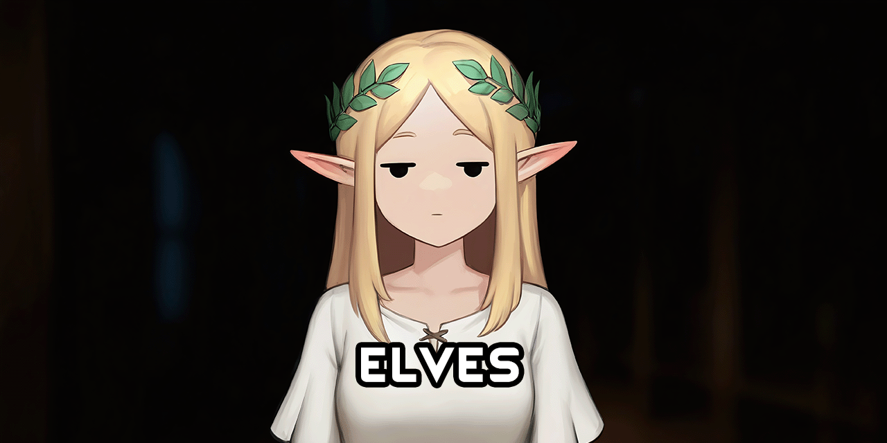

<!--![CC BY-NC-SA 4.0][badge-license]-->
[badge-license]: https://img.shields.io/badge/License-CC_BY--NC--SA_4.0-lightgray?style=for-the-badge
<!--![C# Expansion][badge-c-expansion] expansions with C#-->
[badge-c-expansion]: https://img.shields.io/badge/C%23-Expansion-blue?style=for-the-badge
<!--![C# Patches][badge-c-patches] patch mods with C#-->
[badge-c-patches]: https://img.shields.io/badge/C%23-Patches-green?style=for-the-badge
<!--![XML Expansion][badge-xml-expansion] XML-only expansions-->
[badge-xml-expansion]: https://img.shields.io/badge/XML-Expansion-blue?style=for-the-badge
<!--![XML Patches][badge-xml-patches] XML-only patch mods-->
[badge-xml-patches]: https://img.shields.io/badge/XML-Patches-green?style=for-the-badge
<!--![Supports Royalty][badge-dlc-royalty] supports Royalty DLC-->
[badge-dlc-royalty]: https://img.shields.io/badge/DLC-Royalty-gold?style=for-the-badge
<!--![Supports Ideology][badge-dlc-ideology] supports Ideology DLC-->
[badge-dlc-ideology]: https://img.shields.io/badge/DLC-Ideology-indianred?style=for-the-badge
<!--![Supports Biotech][badge-dlc-biotech] supports Biotech DLC-->
[badge-dlc-biotech]: https://img.shields.io/badge/DLC-Biotech-mediumturquoise?style=for-the-badge
<!--![Supports Anomaly][badge-dlc-anomaly] supports Anomaly DLC-->
[badge-dlc-anomaly]: https://img.shields.io/badge/DLC-Anomaly-darkseagreen?style=for-the-badge

# elf expansion

![CC BY-NC-SA 4.0][badge-license] ![XML Expansion][badge-xml-expansion] ![Supports Biotech][badge-dlc-biotech]

Scope of this mod:
- Add xenoptypes inspired by the [fantasy races of Faerûn](https://archive.org/details/races-of-faerun)

## Additions
- Elves, drow, wood elves, and an industrial faction for them
- Goblins, hobgoblins, and a tribal faction for them

## To-do:
- Add Vanilla Apparel Expanded tunic to elf syndicate pawnkind tags
- Flesh out factions with unique content
- - Mainly pawnkinds and raid compositions, not a bloated compendium of elf-themed crap

# Legal
Portions of the materials used to create this mod are trademarks and/or copyrighted works of Ludeon Studios Inc. All rights reserved by Ludeon. This mod is not official and is not endorsed by Ludeon.

Elf by Lima Studio from [Noun Project](https://thenounproject.com/) (CC BY 3.0)\
Goblin by Lima Studio from [Noun Project](https://thenounproject.com/) (CC BY 3.0)\
Goblin camp icon by Delapouite from [Game-icons.net](https://game-icons.net/) (CC BY 3.0)